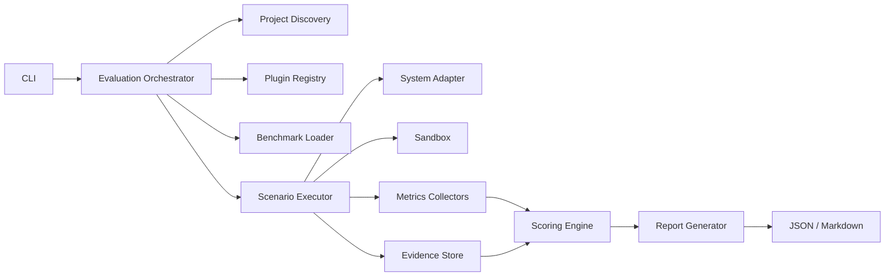

# System Architecture

## Recommended Architecture Style

Use a modular monolith for the MVP.

Do not begin with microservices.

## High-Level Components



## Component Responsibilities

### CLI

- argument parsing
- user feedback
- exit codes
- configuration overrides

### Evaluation Orchestrator

- run lifecycle
- dependency coordination
- resume logic
- failure boundaries
- execution policy

### Project Discovery

- framework detection
- entry-point discovery
- environment inspection
- adapter recommendations

### Plugin Registry

- plugin discovery
- version compatibility
- capability negotiation
- dependency validation

### Benchmark Loader

- schema validation
- fixture loading
- scenario filtering
- version tracking

### Scenario Executor

- scenario lifecycle
- timeout enforcement
- retries
- isolation
- trace capture

### System Adapter

Standard interface between GAUNTLET and the system under test.

### Metrics Collectors

- success
- latency
- token use
- tool calls
- retries
- exceptions
- state transitions

### Evidence Store

Persists the raw basis for findings and scores.

### Scoring Engine

- metric normalization
- dimension scoring
- policy application
- confidence calculation

### Report Generator

- executive summary
- technical findings
- regression changes
- machine-readable output

## Suggested Repository Structure

```text
gauntlet/
├── pyproject.toml
├── src/gauntlet/
│   ├── cli/
│   ├── config/
│   ├── core/
│   ├── discovery/
│   ├── execution/
│   ├── evidence/
│   ├── metrics/
│   ├── scoring/
│   ├── reporting/
│   ├── plugins/
│   └── adapters/
├── plugins/
│   └── agent_core/
├── benchmarks/
│   └── agent_mvp/
├── examples/
│   └── sample_agent/
├── tests/
├── docs/
└── artifacts/
```

## Architectural Boundaries

- Core must not import plugin-specific framework packages.
- Plugins may depend on the core SDK.
- Benchmarks declare required capabilities.
- Adapters expose systems under test through stable protocols.
- Reports consume normalized run data, not framework-specific objects.

## Persistence

Use filesystem-backed artifacts for the MVP.

Optional SQLite index may be added for querying run metadata.

Avoid requiring PostgreSQL.

## Concurrency

Start with bounded local process concurrency.

Do not execute untrusted code inside the main GAUNTLET process.
