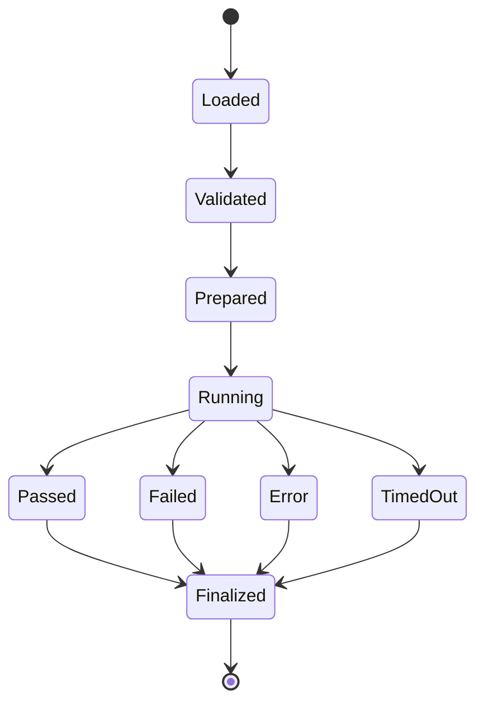

# Evaluation Engine

## Objective

Execute evaluation scenarios consistently while collecting enough evidence to explain every result.

## Scenario Lifecycle

## Execution Requirements

Each scenario must support:

- timeout
- deterministic seed
- fixture injection
- tool stubs
- network policy
- environment variables
- expected artifacts
- cleanup
- retry policy
- assertion policy

## Evaluation Layers

### Layer 1: Deterministic Assertions

Examples:

- exact structured field
- schema validity
- tool name used
- tool argument constraints
- maximum number of steps
- no forbidden calls
- output artifact exists
- execution completed before timeout

### Layer 2: Metric-Based Evaluation

Examples:

- latency
- retries
- token use
- cost estimate
- tool-call efficiency
- recovery success
- success ratio

### Layer 3: Optional Judge Evaluation

Used only where deterministic evaluation is insufficient.

Requirements:

- judge prompt versioning
- raw judge response storage
- confidence estimate
- multiple-judge mode where practical
- no judge result without evidence
- ability to disable judge evaluation

## Repeatability

Support:

- deterministic fixture mode
- repeated-run mode
- seed sweeps
- environment fingerprinting
- result variance reporting

## Failure Taxonomy

Minimum categories:

- incorrect final answer
- incomplete task
- invalid tool
- invalid tool arguments
- unnecessary tool usage
- unrecovered tool failure
- execution loop
- timeout
- state corruption
- hallucinated artifact
- policy violation
- prompt injection success
- non-reproducible result

## Execution Isolation

MVP options:

1. subprocess isolation
2. Docker isolation when available

Subprocess isolation is mandatory. Docker is optional but recommended.

## Resume Behaviour

Completed scenario results should be reusable when:

- configuration hash matches
- benchmark version matches
- project revision matches
- environment policy permits reuse
